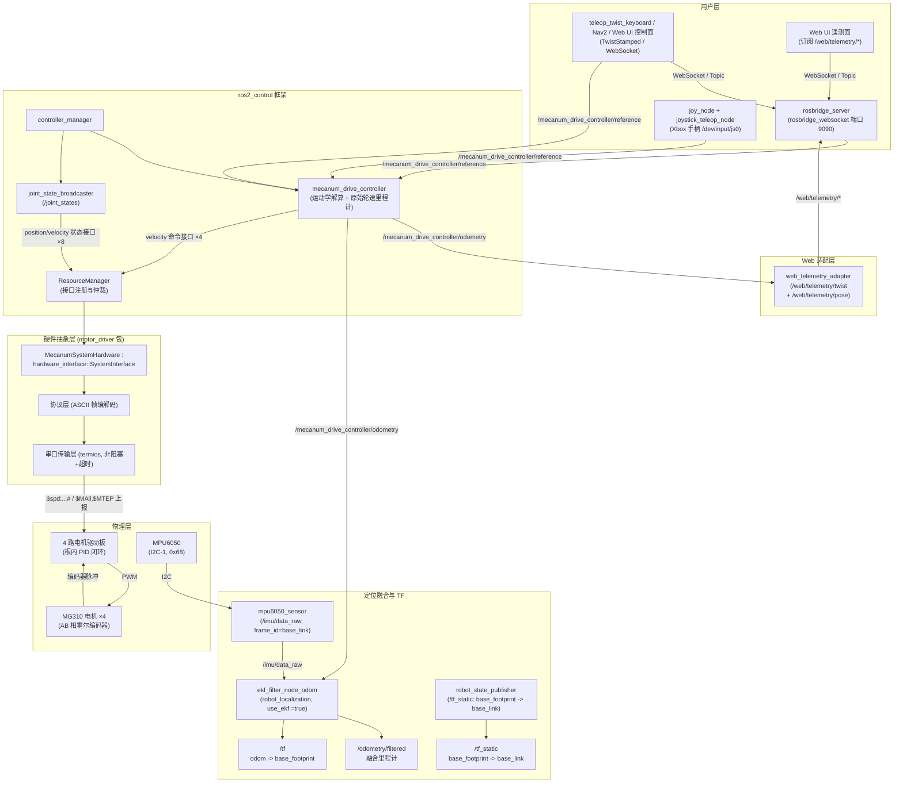

# smart_car_robot —— 四轮麦克纳姆轮全向移动小车

基于 **ROS 2 Jazzy + ros2_control** 的四轮麦克纳姆轮全向移动平台。项目远程仓库为： [smart_car_robot](https://github.com/changBin-x/smart_car_robot.git)
上层使用 `ros2_controllers` 自带的 `mecanum_drive_controller` 做全向运动学解算与原始轮速里程计，实车可显式启用 `robot_localization` 的 `ekf_filter_node_odom`，将轮速里程计速度量与 MPU6050 的 `/imu/data_raw` 融合为 `/odometry/filtered`，并由 EKF 独占发布 `odom -> base_footprint` 动态 TF。项目集成 `rosbridge_server` 提供 WebSocket 通信服务，并通过 `web_telemetry_adapter` 向 Web UI 输出轻量遥测话题，同时支持 Xbox 手柄遥控（`joy` + 自定义 `joystick_teleop` 节点），
底层通过自研 `hardware_interface::SystemInterface` 插件（`motor_driver`）经 USB 串口
驱动 4 路电机驱动板，闭环控制 4 个 MG310 霍尔编码器减速电机。

- 开发/仿真环境：WSL2 + Ubuntu 24.04（mock 硬件，无串口）
- 部署环境：树莓派 4B + Ubuntu 24.04 Server（实机串口 `/dev/ttyUSB0`，可配置）。树莓派 4B 的默认 IP 是 `192.168.10.17`，账户名是 `bean`，WSL2 可以免密登录进入树莓派 4B 的 shell，树莓派使用 zsh 终端，Python 路径在 `~/Documents/ros2_venv/bin/python3`。项目代码在树莓派 4B 的 `~/smart_car_robot` 目录下，树莓派 4B 只能从远程仓库拉取最新代码，禁止在树莓派上修改和推送代码。

## 1. 硬件清单

| 部件       | 型号/规格                                                  | 数量 | 说明                   |
| ---------- | ---------------------------------------------------------- | ---- | ---------------------- |
| 主控       | 树莓派 4B（Ubuntu 24.04 Server）                           | 1    | 运行 ROS 2 Jazzy       |
| 电机驱动板 | 4 路编码器电机驱动板（MSPM0 协处理器，Type-C 串口）        | 1    | 115200-8N1 ASCII 协议  |
| 电机       | MG310 霍尔编码器减速电机（7.4 V，减速比 20，编码器 13 线） | 4    | 额定 400 rpm           |
| 车轮       | 麦克纳姆轮 Ø60 mm                                          | 4    | 左前/右前为镜像 A/B 轮 |
| 电池       | 2S 锂电（7.4 V，5–12 V 均可）                              | 1    | 驱动板供电             |
| 数据线     | USB A → Type-C                                             | 1    | 树莓派 ↔ 驱动板串口    |
| IMU        | MPU6050（I2C，地址 0x68）                                  | 1    | 原始 IMU，芯片中心等同 `base_link` 原点 |
| USB 摄像机 | 海康 1080P UVC（`/dev/hik_monocular`）                    | 1    | `usb_cam` ROS 图像采集 |
| 手柄       | Xbox 无线/有线手柄（Linux 设备 `/dev/input/js0`）          | 1    | 遥控手柄（可选）       |

### 接线说明

```
树莓派 4B  ──USB A→Type-C──  4 路电机驱动板  ──XH2.54-2PIN×4──  电机电源线
                              │            ──PH2.0-6PIN×4───  编码器线
                              └─5V-12V 电源端子 ── 2S 锂电池
```

- 每个电机 2 组线：**XH2.54-2PIN**（电机电源）+ **PH2.0-6PIN**（编码器：电机−、编码器电源、A 相、B 相、编码器地、电机+）。
- 驱动板电机接口与车轮位置固件绑定，必须按下表接线：

| 板载丝印 | 车轮位置 | ROS 关节名                |
| -------- | -------- | ------------------------- |
| M1       | 右前     | `front_right_wheel_joint` |
| M2       | 左前     | `front_left_wheel_joint`  |
| M3       | 右后     | `rear_right_wheel_joint`  |
| M4       | 左后     | `rear_left_wheel_joint`   |

- 驱动板由电池供电，Type-C 仅作串口通信；树莓派独立供电。
- 串口协议细节（指令表、单位换算公式）请参考 [协议总结](docs/协议总结.md) 。
- MPU6050 接线：VCC → 树莓派 3.3V，GND → GND，SDA → GPIO 2 (Pin 3)，SCL → GPIO 3 (Pin 5)，AD0 → GND（地址 0x68）。
- MPU6050 安装：芯片中心按机械定义等同 `base_link` 原点，坐标轴需与车体右手系对齐：`+x` 向前、`+y` 向左、`+z` 向上。

## 2. 软件架构



- **mecanum_drive_controller**：订阅 `TwistStamped` 期望速度，按麦轮逆运动学拆成 4 个轮子的
  `velocity` 命令；同时用轮速正运动学积分出 `/mecanum_drive_controller/odometry` 原始里程计。控制器配置为 `enable_odom_tf=false`，不发布最终里程计动态 TF。
- **robot_localization EKF**：`use_ekf:=true` 时启动 `ekf_filter_node_odom`，读取轮速里程计速度量与 `/imu/data_raw`，输出 `/odometry/filtered`，并发布唯一的 `odom -> base_footprint` 动态 TF。
- **robot_state_publisher**：根据 URDF 发布静态 TF，其中 `base_footprint -> base_link` 把地面投影坐标系连接到车体坐标系；如需验证到 `base_link`，使用 `odom -> base_footprint -> base_link` 链路。
- **MPU6050 IMU**：发布 `/imu/data_raw`，`frame_id` 为 `base_link`；芯片中心按机械安装等同 `base_link` 原点，右手系为 `+x` 前、`+y` 左、`+z` 上。
- **joint_state_broadcaster**：把 8 个状态接口转发为 `/joint_states`。
- **web_telemetry_adapter**：订阅 `/mecanum_drive_controller/odometry`，提取平面速度与二维位姿，发布 `/web/telemetry/twist` 和 `/web/telemetry/pose` 供 Web UI 订阅。位姿消息使用保留时间戳和坐标系的 `geometry_msgs/msg/PoseStamped`。
- **rosbridge_server**：启动 WebSocket 服务（包含 `rosbridge_websocket_launch.xml`），默认监听端口 `9090`。Web UI 不再直接订阅 `/mecanum_drive_controller/odometry`，而是通过 `/web/telemetry/*` 消费轻量遥测数据。
- **Xbox 手柄遥控**：启动 `joy_node` 接入 `/dev/input/js0` 设备，由单一 `joystick_teleop_node` 统一处理左摇杆、D-pad、LB 安全使能和 RB Turbo，并输出 `TwistStamped`。当前实测手柄使用 `Axis 6/7` 的方向键轴输入（上 `+1`、下 `-1`、左 `-1`、右 `+1`），以恒定速度控制前后和左右平移；右摇杆不参与控制。详细映射见 [Xbox 手柄映射图](docs/xbox_手柄映射.png)。
- **motor_driver**：读——解析驱动板周期上报的编码器计数，换算 rad / rad/s；
  写——把 rad/s 命令换算为 mm/s 下发 `$spd` 指令。详见 [motor_driver/README.md](src/motor_driver/README.md)。
- **mock 模式**（WSL2）：`<ros2_control>` 内换用 `mock_components/GenericSystem`，
  命令值直接回环到状态值，无需串口即可调试控制器链路；`use_ekf` 默认 `false`，mock 启动不会默认拉起 IMU 或 EKF。

## 3. 目录结构

本仓库根即 colcon 工作空间根，ROS 包位于 `src/` 下，克隆后可直接编译：

```
smart_car_robot/                     # 仓库根 = colcon 工作空间根
├── README.md                        # 本文件（项目总览）
├── LICENSE
├── .clangd                          # clangd 配置（C++20、诊断规则）
├── scripts/                         # 编译/环境脚本
│   ├── build.sh                     #   一键编译 + 生成 compile_commands.json
│   ├── setup_clangd.sh              #   汇总各包编译数据库到仓库根
│   └── README.md
├── docs/                            # 硬件资料、通信接口与协议总结
│   ├── M310电机/
│   ├── 电机驱动板/
│   ├── ROS-Jazzy通信接口.md
│   └── 协议总结.md
└── src/                             # ROS 包源码目录
    ├── ros2_mpu6050/                #   MPU6050 IMU 驱动（源码纳入本仓库，非 submodule）
    │   └── ...                      #     基于 https://github.com/kimsniper/ros2_mpu6050，默认地址 0x68
    ├── motor_driver/                #   硬件接口插件包 (ament_cmake)
    │   ├── include/motor_driver/    #     SystemInterface 实现 + 协议/串口分层
    │   ├── src/
    │   ├── test/                    #     协议层单元测试
    │   ├── motor_driver.xml         #     pluginlib 导出描述
    │   ├── README.md
    │   ├── CMakeLists.txt
    │   └── package.xml
    └── smartcar_bringup/            #   模型 + 控制器配置 + 启动包
        ├── urdf/                    #     xacro（底盘 + 4 轮 + ros2_control 标签）
        ├── config/                  #     controllers.yaml + ekf_odom.yaml + xbox_teleop.yaml
        ├── launch/                  #     bringup launch（含 rosbridge_server 与手柄遥控）
        ├── doc/                     #     验证手册
        ├── README.md
        ├── CMakeLists.txt
        └── package.xml
```

## 4. 环境搭建

### 4.1 WSL2 开发机（Ubuntu 24.04）

```bash
# 1. 安装 ROS 2 Jazzy（含 desktop 与开发工具，按官方 deb 源方式）
sudo apt update && sudo apt install -y software-properties-common curl
sudo add-apt-repository universe
sudo curl -sSL https://raw.githubusercontent.com/ros/rosdistro/master/ros.key \
     -o /usr/share/keyrings/ros-archive-keyring.gpg
echo "deb [arch=$(dpkg --print-architecture) signed-by=/usr/share/keyrings/ros-archive-keyring.gpg] \
     http://packages.ros.org/ros2/ubuntu $(. /etc/os-release && echo $UBUNTU_CODENAME) main" | \
     sudo tee /etc/apt/sources.list.d/ros2.list > /dev/null
sudo apt update && sudo apt install -y ros-jazzy-desktop ros-dev-tools

# 2. 本项目依赖
sudo apt install -y \
  ros-jazzy-ros2-control \
  ros-jazzy-ros2-controllers \
  ros-jazzy-xacro \
  ros-jazzy-robot-state-publisher \
  ros-jazzy-robot-localization \
  ros-jazzy-rosbridge-server \
  ros-jazzy-joy \
  ros-jazzy-teleop-twist-joy \
  ros-jazzy-teleop-twist-keyboard

# 3. 环境变量（写入 ~/.bashrc）
echo "source /opt/ros/jazzy/setup.bash" >> ~/.bashrc && source ~/.bashrc
```

> WSL2 无串口硬件，统一用 `use_mock_hardware:=true`（launch 默认值）调试。

#### 代码补全：clangd

本项目使用 **clangd** 作为 C++ 语言服务器（代码补全、跳转、诊断），不使用
Microsoft C/C++ 扩展的 IntelliSense。clangd 依赖 `compile_commands.json`
获取每个源文件的编译参数，由脚本自动生成：

```bash
# 安装 clangd（VS Code 另需安装 "clangd" 扩展并禁用 C/C++ 的 IntelliSense）
sudo apt install -y clangd

# 生成 compile_commands.json（在仓库根的 scripts 目录下执行）
cd ~/projects/smart_car_robot/scripts
./setup_clangd.sh
```

脚本会用 `-DCMAKE_EXPORT_COMPILE_COMMANDS=ON` 编译，并把各包的
`compile_commands.json` 汇总到仓库根，clangd 即可全量索引。
详见 [scripts/README.md](scripts/README.md)。

### 4.2 树莓派 4B 部署机（Ubuntu 24.04 Server）

```bash
# 1. 安装 ROS 2 Jazzy base（无 GUI）：同上 deb 源，把 ros-jazzy-desktop 换成
sudo apt install -y ros-jazzy-ros-base ros-dev-tools

# 2. 本项目依赖（同 4.1 第 2 步）

# 3. 串口权限：把当前用户加入 dialout 组（重新登录生效）
sudo usermod -aG dialout $USER

# 4. I2C（MPU6050）：启用总线并安装开发库
sudo apt install -y libi2c-dev i2c-tools
# raspi-config / 设备树确认 I2C 已启用后：
i2cdetect -y 1   # 应在 68 处看到 MPU6050

# 5. USB 单目相机（MJPEG 1080P@30）
sudo apt install -y ros-jazzy-usb-cam ros-jazzy-camera-calibration \
  ros-jazzy-web-video-server ros-jazzy-image-transport-plugins
# 确认设备节点并确保当前用户属于 video 组
ls /dev/video*
groups | grep video

# 6. 确认驱动板设备名（插上 Type-C 后）
ls /dev/ttyUSB* /dev/ttyACM*
# 如果不是 /dev/ttyUSB0，启动时用 serial_port launch 参数覆盖
```

> 建议：为驱动板做 udev 固定别名（防止多 USB 设备时序号漂移），后续路线图中提供规则示例。

> **摄像机方案**：`usb_cam` 独占设备并以实测可达的 MJPEG `1920×1080@30 fps` 采集，原始图像发布为 `/hik_monocular/image_raw`（`rgb8`）。可选 `web_video_server` 仅生成 `640×360` 的浏览器预览；相机与 Web 预览默认均关闭。

## 5. 编译与启动

本仓库根即 colcon 工作空间根，克隆后直接在仓库根编译：

```bash
# 首次获取代码
mkdir -p ~ && cd ~
git clone -b feature_rpi4B https://github.com/changBin-x/smart_car_robot.git
cd smart_car_robot

# 方式一：使用脚本一键编译（推荐，同时生成 clangd 所需的 compile_commands.json）
cd scripts
./build.sh

# 方式二：手动编译（在仓库根执行）
cd ~/smart_car_robot
colcon build --symlink-install
source install/setup.bash
```

启动命令：

```bash
# WSL2：mock 硬件启动（默认 use_mock_hardware:=true，含 WebSocket 端口 9090）
ros2 launch smartcar_bringup smartcar.launch.py

# 树莓派：实机启动（含电机栈 + MPU6050 → /imu/data_raw + WebSocket 端口 9090；
# 不启 EKF，保留原始轮速里程计链路）
ros2 launch smartcar_bringup smartcar.launch.py \
  use_mock_hardware:=false serial_port:=/dev/ttyUSB0

# 树莓派：实机启动 + 里程计 / MPU6050 EKF 融合
# 注意：use_ekf 默认 false，实车融合必须显式设置 use_ekf:=true
ros2 launch smartcar_bringup smartcar.launch.py \
  use_mock_hardware:=false serial_port:=/dev/ttyUSB0 use_ekf:=true

# 树莓派：实机启动 + 一键启用 Xbox 手柄遥控（/dev/input/js0）
ros2 launch smartcar_bringup smartcar.launch.py \
  use_mock_hardware:=false serial_port:=/dev/ttyUSB0 use_joy:=true

# 树莓派：实机启动并显式启用 USB 单目相机与浏览器预览
ros2 launch smartcar_bringup smartcar.launch.py \
  use_mock_hardware:=false serial_port:=/dev/ttyUSB0 \
  use_hik_camera:=true use_web_preview:=true

# 独立启动 Xbox 手柄遥控
ros2 launch smartcar_bringup joy_teleop.launch.py joy_dev:=/dev/input/js0

# Xbox 手柄映射图
# 可编辑源文件：docs/xbox_手柄映射.drawio
# PNG 预览：docs/xbox_手柄映射.png

# 仅启动 IMU（可选）
ros2 launch smartcar_bringup mpu6050.launch.py

# 仅启动 USB 单目相机（默认不启浏览器预览）
ros2 launch hik_camera_bringup hik_camera.launch.py

# 键盘遥控（Jazzy 的 mecanum_drive_controller 订阅 TwistStamped，
# teleop 需加 stamped:=true 并 remap 到控制器 reference 话题）
ros2 run teleop_twist_keyboard teleop_twist_keyboard \
  --ros-args -p stamped:=true \
  -r /cmd_vel:=/mecanum_drive_controller/reference
```

启用 EKF 前，请让小车静止数秒，确认 MPU6050 偏置稳定后再开始运动测试。

Web 遥测接口约定：

- Web UI 速度遥测：`/web/telemetry/twist`（`geometry_msgs/msg/TwistStamped`）
- Web UI 位姿遥测：`/web/telemetry/pose`（`geometry_msgs/msg/PoseStamped`；只使用 `pose.position.x/y` 和平面偏航四元数）
- ROS 内部原始里程计：`/mecanum_drive_controller/odometry`（`nav_msgs/msg/Odometry`，保留给调试、录包与算法模块）
- ROS 融合里程计：`/odometry/filtered`（`nav_msgs/msg/Odometry`，保留给定位、导航和调试，不作为 Web 遥测输入）
- Web 遥测链路固定订阅原始 `/mecanum_drive_controller/odometry`，即使启用 EKF，也不要把 `web_telemetry_adapter` 切到 `/odometry/filtered`。
- 这样拆分的原因是：树莓派实机上的 `rosbridge_websocket` 直接序列化原始 `Odometry`
  或旧版 `Pose2D` 时可能报 `cannot serialize type ...`。因此 Web UI 必须只订阅适配器发布的
  `TwistStamped` 与 `PoseStamped`。

常用 launch 参数：

| 参数 | 默认值 | 说明 |
| --- | --- | --- |
| `use_mock_hardware` | `true` | WSL2 用 mock；树莓派实机设 `false` |
| `serial_port` | `/dev/ttyUSB0` | 实机驱动板串口设备名 |
| `baud_rate` | `115200` | 驱动板串口波特率 |
| `use_ekf` | `false` | 是否启动 `ekf_filter_node_odom`；实车融合必须显式设为 `true`，mock 默认不启 |
| `i2c_device` | `/dev/i2c-1` | MPU6050 I2C 总线设备 |
| `i2c_address` | `0x68` | MPU6050 I2C 地址，AD0 接 GND 时为 `0x68` |
| `use_joy` | `false` | 是否同时启动 Xbox 手柄遥控栈 |
| `joy_dev` | `/dev/input/js0` | 手柄 Linux 设备节点路径 |
| `use_hik_camera` | `false` | 是否包含 `hik_camera_bringup` 相机采集链路 |
| `use_web_preview` | `false` | 仅在已启用相机时，是否启动 `web_video_server` 预览 |

摄像机接口：`/hik_monocular/image_raw`、`/hik_monocular/camera_info` 与
`/hik_monocular/image_raw/compressed`。浏览器预览使用
`http://<pi-ip>:8080/stream?topic=/hik_monocular/image_raw&width=640&height=360&quality=70`；该服务仅在 `use_web_preview:=true` 时存在。

树莓派额外依赖：

- EKF：`sudo apt install -y ros-jazzy-robot-localization`
- IMU：`sudo apt install -y libi2c-dev i2c-tools`（编译链接 `libi2c`，并用 `i2cdetect -y 1` 确认地址 `0x68`）
- 摄像机：`sudo apt install -y ros-jazzy-usb-cam ros-jazzy-camera-calibration ros-jazzy-web-video-server ros-jazzy-image-transport-plugins`

融合验证命令：

```bash
# 1. 安装依赖并重新编译相关包
sudo apt install -y ros-jazzy-robot-localization libi2c-dev i2c-tools
colcon build --symlink-install --packages-select ros2_mpu6050 smartcar_bringup
source install/setup.bash

# 2. 实机显式启用 EKF；验证时可先关闭摄像机减少干扰
ros2 launch smartcar_bringup smartcar.launch.py \
  use_mock_hardware:=false serial_port:=/dev/ttyUSB0 use_ekf:=true

# 3. 检查输入、输出和 TF 链路
ros2 topic hz /imu/data_raw
ros2 topic hz /mecanum_drive_controller/odometry
ros2 topic hz /odometry/filtered
ros2 topic info /odometry/filtered
ros2 topic info /tf
ros2 topic echo /odometry/filtered --once
ros2 run tf2_ros tf2_echo odom base_footprint
ros2 run tf2_ros tf2_echo odom base_link
```

`tf2_echo odom base_link` 的结果来自 `odom -> base_footprint -> base_link` 链路：前半段由 EKF 发布，后半段由 URDF 和 `robot_state_publisher` 静态发布。完整验证命令（控制器状态、硬件接口、里程计方向、相机采集）请参考 [验证手册](src/smartcar_bringup/doc/验证手册.md) 。

## 6. 后续路线图

- [x] **任务 2**：`motor_driver` 硬件接口插件（串口协议实现 + 完整生命周期 + 故障容错）
- [x] **任务 3**：`smartcar_bringup`（xacro 模型、controllers.yaml、launch、验证文档）
- [x] WSL2 mock 验收：前进 / 横移 / 原地旋转的 `/mecanum_drive_controller/odometry` 方向验证
- [x] 树莓派实机编码器倍频标定：地面直行实测确定 `count_multiplier=4`
- [x] 电机方向系数校准（2026-07-19：`direction_m2/m3=-1`）
- [x] 电池电量：`$read_vol#` → `/battery_state`（`sensor_msgs/BatteryState`）
- [x] 接入 WebSocket 桥接（`rosbridge_server` 端口 9090）与 Web 遥测适配层（`/web/telemetry/*`）
- [x] 集成 Xbox 手柄遥控（`joy` + `joystick_teleop`），支持 D-pad 恒速平移
- [x] USB 单目相机 ROS 采集（`usb_cam`、MJPEG `1920×1080@30 fps`、可选 Web 预览）
- [x] 接入 MPU6050 与 `robot_localization` EKF，输出 `/odometry/filtered` 和 `odom -> base_footprint`
- [x] 树莓派地面直行 EKF 验证：编码器纵向误差约 `2.5%`，确认 `odom.y` 需按起始航向换算
- [ ] 树莓派实机动态验证 EKF：静止偏置、直行 / 横移 / 旋转方向、`/tf` 发布者唯一性
- [ ] udev 规则固定串口别名（`/dev/smartcar_driver`）
- [ ] 接入 Nav2 导航栈与 SLAM（slam_toolbox）
- [ ] systemd 开机自启动 bringup
