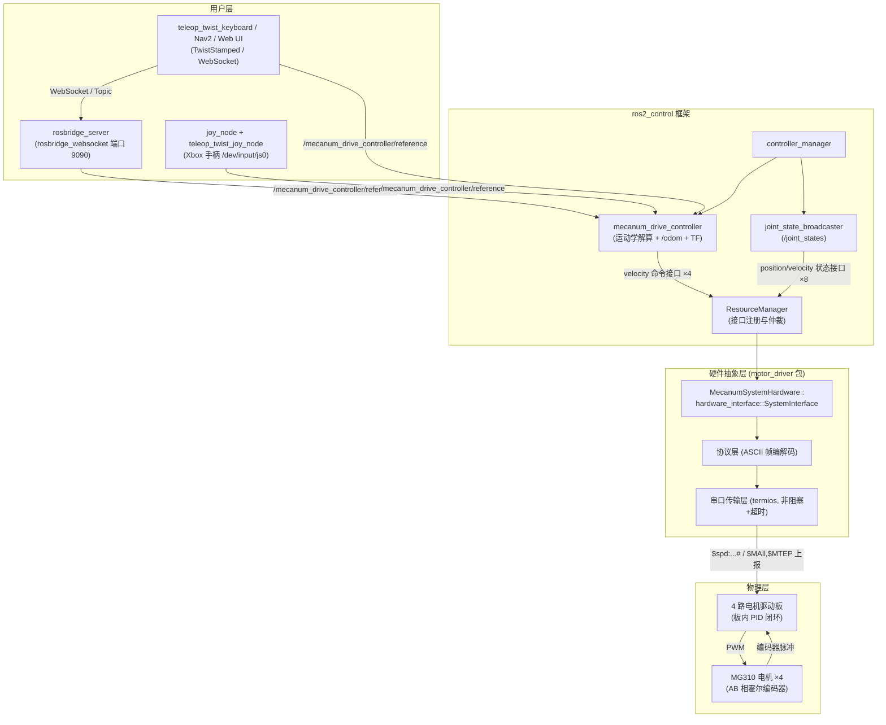

# smart_car_robot —— 四轮麦克纳姆轮全向移动小车

基于 **ROS 2 Jazzy + ros2_control** 的四轮麦克纳姆轮全向移动平台。项目远程仓库为： [smart_car_robot](https://github.com/changBin-x/smart_car_robot.git)
上层使用 `ros2_controllers` 自带的 `mecanum_drive_controller` 做全向运动学解算与里程计，集成 `rosbridge_server` 提供 WebSocket 通信服务，并支持 Xbox 手柄遥控（`joy` + `teleop_twist_joy`），
底层通过自研 `hardware_interface::SystemInterface` 插件（`motor_driver`）经 USB 串口
驱动 4 路电机驱动板，闭环控制 4 个 MG310 霍尔编码器减速电机。

- 开发/仿真环境：WSL2 + Ubuntu 24.04（mock 硬件，无串口）
- 部署环境：树莓派 4B + Ubuntu 24.04 Server（实机串口 `/dev/ttyUSB0`，可配置）。树莓派 4B 的默认 IP 是 `192.168.10.12`，账户名是 `bean`，WSL2 可以免密登录进入树莓派 4B 的 shell，树莓派使用 zsh 终端，Python 路径在 `~/Documents/ros2_venv/bin/python3`。项目代码在树莓派 4B 的 `~/projects/smart_car_robot` 目录下，树莓派 4B 只能从远程仓库拉取最新代码，禁止在树莓派上修改和推送代码。

## 1. 硬件清单

| 部件       | 型号/规格                                                  | 数量 | 说明                   |
| ---------- | ---------------------------------------------------------- | ---- | ---------------------- |
| 主控       | 树莓派 4B（Ubuntu 24.04 Server）                           | 1    | 运行 ROS 2 Jazzy       |
| 电机驱动板 | 4 路编码器电机驱动板（MSPM0 协处理器，Type-C 串口）        | 1    | 115200-8N1 ASCII 协议  |
| 电机       | MG310 霍尔编码器减速电机（7.4 V，减速比 20，编码器 13 线） | 4    | 额定 400 rpm           |
| 车轮       | 麦克纳姆轮 Ø60 mm                                          | 4    | 左前/右前为镜像 A/B 轮 |
| 电池       | 2S 锂电（7.4 V，5–12 V 均可）                              | 1    | 驱动板供电             |
| 数据线     | USB A → Type-C                                             | 1    | 树莓派 ↔ 驱动板串口    |
| IMU        | MPU6050（I2C，地址 0x68）                                  | 1    | 6 轴姿态传感器         |
| USB 摄像机 | 1080P UVC（`/dev/video0`）                                 | 1    | MJPEG-HTTP 旁路推流    |
| 手柄       | Xbox 无线/有线手柄（Linux 设备 `/dev/input/js0`）          | 1    | 遥控手柄（可选）       |

### 接线说明

```
树莓派 4B  ──USB A→Type-C──  4 路电机驱动板  ──XH2.54-2PIN×4──  电机电源线
                              │            ──PH2.0-6PIN×4───  编码器线
                              └─5V-12V 电源端子 ── 2S 锂电池
```

- 每个电机 2 组线：**XH2.54-2PIN**（电机电源）+ **PH2.0-6PIN**（编码器：电机−、编码器电源、A 相、B 相、编码器地、电机+）。
- 驱动板电机接口与车轮位置固件绑定，必须按下表接线：

| 板载丝印 | 车轮位置 | ROS 关节名                |
| -------- | -------- | ------------------------- |
| M1       | 右前     | `front_right_wheel_joint` |
| M2       | 左前     | `front_left_wheel_joint`  |
| M3       | 右后     | `rear_right_wheel_joint`  |
| M4       | 左后     | `rear_left_wheel_joint`   |

- 驱动板由电池供电，Type-C 仅作串口通信；树莓派独立供电。
- 串口协议细节（指令表、单位换算公式）请参考 [协议总结](docs/协议总结.md) 。
- MPU6050 接线：VCC → 树莓派 3.3V，GND → GND，SDA → GPIO 2 (Pin 3)，SCL → GPIO 3 (Pin 5)，AD0 → GND（地址 0x68）。

## 2. 软件架构



- **mecanum_drive_controller**：订阅 `TwistStamped` 期望速度，按麦轮逆运动学拆成 4 个轮子的
  `velocity` 命令；同时用轮速正运动学积分出 `/odom` 并发布 `odom → base_link` TF。
- **joint_state_broadcaster**：把 8 个状态接口转发为 `/joint_states`。
- **rosbridge_server**：启动 WebSocket 服务（包含 `rosbridge_websocket_launch.xml`），默认监听端口 `9090`，方便网页及上层 UI 远程调用 ROS 2 话题与服务。
- **Xbox 手柄遥控**：启动 `joy_node` 接入 `/dev/input/js0` 设备，由 `teleop_twist_joy_node` 转换左摇杆上下（前后移动）、左摇杆左右（转弯）与右摇杆左右（左右平移）为 `TwistStamped`。
- **motor_driver**：读——解析驱动板周期上报的编码器计数，换算 rad / rad/s；
  写——把 rad/s 命令换算为 mm/s 下发 `$spd` 指令。详见 [motor_driver/README.md](src/motor_driver/README.md)。
- **mock 模式**（WSL2）：`<ros2_control>` 内换用 `mock_components/GenericSystem`，
  命令值直接回环到状态值，无需串口即可全链路调试控制器与 TF。

## 3. 目录结构

本仓库根即 colcon 工作空间根，ROS 包位于 `src/` 下，克隆后可直接编译：

```
smart_car_robot/                     # 仓库根 = colcon 工作空间根
├── README.md                        # 本文件（项目总览）
├── LICENSE
├── .clangd                          # clangd 配置（C++20、诊断规则）
├── scripts/                         # 编译/环境脚本
│   ├── build.sh                     #   一键编译 + 生成 compile_commands.json
│   ├── setup_clangd.sh              #   汇总各包编译数据库到仓库根
│   └── README.md
├── docs/                            # 硬件资料与协议总结
│   ├── M310电机/
│   ├── 电机驱动板/
│   └── 协议总结.md
└── src/                             # ROS 包源码目录
    ├── ros2_mpu6050/                #   MPU6050 IMU 驱动（源码纳入本仓库，非 submodule）
    │   └── ...                      #     基于 https://github.com/kimsniper/ros2_mpu6050，默认地址 0x68
    ├── motor_driver/                #   硬件接口插件包 (ament_cmake)
    │   ├── include/motor_driver/    #     SystemInterface 实现 + 协议/串口分层
    │   ├── src/
    │   ├── test/                    #     协议层单元测试
    │   ├── motor_driver.xml         #     pluginlib 导出描述
    │   ├── README.md
    │   ├── CMakeLists.txt
    │   └── package.xml
    └── smartcar_bringup/            #   模型 + 控制器配置 + 启动包
        ├── urdf/                    #     xacro（底盘 + 4 轮 + ros2_control 标签）
        ├── config/                  #     controllers.yaml + xbox_teleop.yaml
        ├── launch/                  #     bringup launch（含 rosbridge_server 与 joy_teleop）
        ├── doc/                     #     验证手册
        ├── README.md
        ├── CMakeLists.txt
        └── package.xml
```

## 4. 环境搭建

### 4.1 WSL2 开发机（Ubuntu 24.04）

```bash
# 1. 安装 ROS 2 Jazzy（含 desktop 与开发工具，按官方 deb 源方式）
sudo apt update && sudo apt install -y software-properties-common curl
sudo add-apt-repository universe
sudo curl -sSL https://raw.githubusercontent.com/ros/rosdistro/master/ros.key \
     -o /usr/share/keyrings/ros-archive-keyring.gpg
echo "deb [arch=$(dpkg --print-architecture) signed-by=/usr/share/keyrings/ros-archive-keyring.gpg] \
     http://packages.ros.org/ros2/ubuntu $(. /etc/os-release && echo $UBUNTU_CODENAME) main" | \
     sudo tee /etc/apt/sources.list.d/ros2.list > /dev/null
sudo apt update && sudo apt install -y ros-jazzy-desktop ros-dev-tools

# 2. 本项目依赖
sudo apt install -y \
  ros-jazzy-ros2-control \
  ros-jazzy-ros2-controllers \
  ros-jazzy-xacro \
  ros-jazzy-robot-state-publisher \
  ros-jazzy-rosbridge-server \
  ros-jazzy-joy \
  ros-jazzy-teleop-twist-joy \
  ros-jazzy-teleop-twist-keyboard

# 3. 环境变量（写入 ~/.bashrc）
echo "source /opt/ros/jazzy/setup.bash" >> ~/.bashrc && source ~/.bashrc
```

> WSL2 无串口硬件，统一用 `use_mock_hardware:=true`（launch 默认值）调试。

#### 代码补全：clangd

本项目使用 **clangd** 作为 C++ 语言服务器（代码补全、跳转、诊断），不使用
Microsoft C/C++ 扩展的 IntelliSense。clangd 依赖 `compile_commands.json`
获取每个源文件的编译参数，由脚本自动生成：

```bash
# 安装 clangd（VS Code 另需安装 "clangd" 扩展并禁用 C/C++ 的 IntelliSense）
sudo apt install -y clangd

# 生成 compile_commands.json（在仓库根的 scripts 目录下执行）
cd ~/projects/smart_car_robot/scripts
./setup_clangd.sh
```

脚本会用 `-DCMAKE_EXPORT_COMPILE_COMMANDS=ON` 编译，并把各包的
`compile_commands.json` 汇总到仓库根，clangd 即可全量索引。
详见 [scripts/README.md](scripts/README.md)。

### 4.2 树莓派 4B 部署机（Ubuntu 24.04 Server）

```bash
# 1. 安装 ROS 2 Jazzy base（无 GUI）：同上 deb 源，把 ros-jazzy-desktop 换成
sudo apt install -y ros-jazzy-ros-base ros-dev-tools

# 2. 本项目依赖（同 4.1 第 2 步）

# 3. 串口权限：把当前用户加入 dialout 组（重新登录生效）
sudo usermod -aG dialout $USER

# 4. I2C（MPU6050）：启用总线并安装开发库
sudo apt install -y libi2c-dev i2c-tools
# raspi-config / 设备树确认 I2C 已启用后：
i2cdetect -y 1   # 应在 68 处看到 MPU6050

# 5. USB 摄像机推流（ustreamer）
sudo apt install -y ustreamer
# 确认设备节点（插上 USB 摄像机后）
ls /dev/video*
# 用户需在 video 组：groups | grep video

# 6. 确认驱动板设备名（插上 Type-C 后）
ls /dev/ttyUSB* /dev/ttyACM*
# 如果不是 /dev/ttyUSB0，启动时用 serial_port launch 参数覆盖
```

> 建议：为驱动板做 udev 固定别名（防止多 USB 设备时序号漂移），后续路线图中提供规则示例。

> **摄像机方案**：UVC 不能真双开，采用 **单实例 `ustreamer` + `camera_ustreamer_ctl`**。采集格式为 YUYV + CPU 编码；低延迟档 `640x480@30`，高清档 `1280x720@15`。MJPEG 推流端口 `8080`，质量切换控制口 `8082`。

## 5. 编译与启动

本仓库根即 colcon 工作空间根，克隆后直接在仓库根编译：

```bash
# 首次获取代码
mkdir -p ~/projects && cd ~/projects
git clone -b feature_rpi4B https://github.com/changBin-x/smart_car_robot.git
cd smart_car_robot

# 方式一：使用脚本一键编译（推荐，同时生成 clangd 所需的 compile_commands.json）
cd scripts
./build.sh

# 方式二：手动编译（在仓库根执行）
cd ~/projects/smart_car_robot
colcon build --symlink-install
source install/setup.bash
```

启动命令：

```bash
# WSL2：mock 硬件启动（默认 use_mock_hardware:=true，含 WebSocket 端口 9090）
ros2 launch smartcar_bringup smartcar.launch.py

# 树莓派：实机启动（含电机栈 + MPU6050 → /imu/data_raw + WebSocket 端口 9090
# + 默认启用摄像机推流 use_camera:=true）
ros2 launch smartcar_bringup smartcar.launch.py \
  use_mock_hardware:=false serial_port:=/dev/ttyUSB0

# 树莓派：实机启动 + 一键启用 Xbox 手柄遥控（/dev/input/js0）
ros2 launch smartcar_bringup smartcar.launch.py \
  use_mock_hardware:=false serial_port:=/dev/ttyUSB0 use_joy:=true

# 树莓派：实机但不启摄像机推流
ros2 launch smartcar_bringup smartcar.launch.py \
  use_mock_hardware:=false serial_port:=/dev/ttyUSB0 use_camera:=false

# 独立启动 Xbox 手柄遥控
ros2 launch smartcar_bringup joy_teleop.launch.py joy_dev:=/dev/input/js0

# 仅启动 IMU（可选）
ros2 launch smartcar_bringup mpu6050.launch.py

# 仅启动摄像机推流（可选，独立 launch）
ros2 launch smartcar_bringup camera.launch.py

# 键盘遥控（Jazzy 的 mecanum_drive_controller 订阅 TwistStamped，
# teleop 需加 stamped:=true 并 remap 到控制器 reference 话题）
ros2 run teleop_twist_keyboard teleop_twist_keyboard \
  --ros-args -p stamped:=true \
  -r /cmd_vel:=/mecanum_drive_controller/reference
```

常用 launch 参数：

| 参数 | 默认值 | 说明 |
| --- | --- | --- |
| `use_mock_hardware` | `true` | WSL2 用 mock；树莓派实机设 `false` |
| `use_camera` | `true` | 是否启用摄像机推流；**仅**在 `use_mock_hardware:=false` 且 `use_camera:=true` 时启动 |
| `camera_device` | `/dev/video0` | UVC 设备路径 |
| `camera_stream_port` | `8080` | MJPEG HTTP 推流端口 |
| `camera_ctl_port` | `8082` | 质量切换 HTTP 控制端口 |

摄像机拉流与切档（旁路 ROS，不经 rosbridge）：

- 画面：`http://<pi-ip>:8080/stream`
- 切档：`http://<pi-ip>:8082/quality?mode=low|high`（`low` = 640×480@30，`high` = 1280×720@15）

树莓派额外依赖：

- IMU：`sudo apt install -y libi2c-dev i2c-tools`（编译链接 `libi2c`，并用 `i2cdetect -y 1` 确认地址 `0x68`）
- 摄像机：`sudo apt install -y ustreamer`

完整验证命令（控制器状态、硬件接口、里程计方向、摄像机推流）请参考 [验证手册](src/smartcar_bringup/doc/验证手册.md) 。

## 6. 后续路线图

- [x] **任务 2**：`motor_driver` 硬件接口插件（串口协议实现 + 完整生命周期 + 故障容错）
- [x] **任务 3**：`smartcar_bringup`（xacro 模型、controllers.yaml、launch、验证文档）
- [x] WSL2 mock 验收：前进 / 横移 / 原地旋转的 `/odom` 方向验证
- [ ] 树莓派实机联调：编码器倍频 K 标定、轮距实测回填
- [x] 电机方向系数校准（2026-07-19：`direction_m2/m3=-1`）
- [x] 电池电量：`$read_vol#` → `/battery_state`（`sensor_msgs/BatteryState`）
- [x] 接入 WebSocket 桥接（`rosbridge_server` 端口 9090）
- [x] 集成 Xbox 手柄遥控（`joy` + `teleop_twist_joy`）
- [x] USB 摄像机 MJPEG 推流（单实例 `ustreamer` + `camera_ustreamer_ctl`，上位机 `MapCameraView` 已接入）
- [ ] udev 规则固定串口别名（`/dev/smartcar_driver`）
- [ ] 加入 IMU + `ekf`（robot_localization）融合里程计
- [ ] 接入 Nav2 导航栈与 SLAM（slam_toolbox）
- [ ] systemd 开机自启动 bringup
